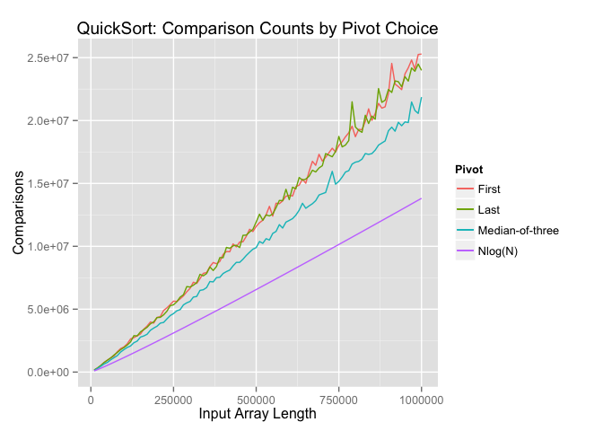
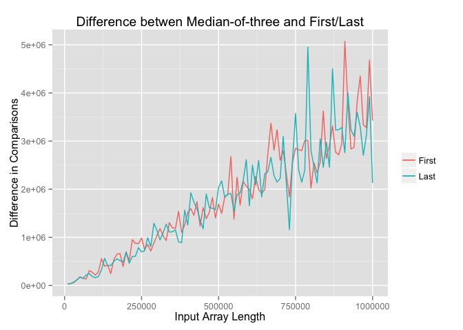

# QuickSort Pivot Type Comparison
Devin Riley  
February 8, 2015  

"Quick comparison" of QuickSort comparison counts for three different median selections:  

* Always choose the first element  
* Always choose the second element
* The median-of-three pivot rule  

What is the *median-of-three pivot* rule?  Explanation from [Tim Roughgarden](http://theory.stanford.edu/~tim/):  

> In more detail, you should choose the pivot as follows. Consider the first, middle, and final elements of the given array. (If the array has odd length it should be clear what the "middle" element is; for an array with even length 2k, use the kth element as the "middle" element. So for the array 4 5 6 7, the "middle" element is the second one ---- 5 and not 6!) Identify which of these three elements is the median (i.e., the one whose value is in between the other two), and use this as your pivot


```r
library(reshape2)
library(ggplot2)
res <- read.csv('data/results.csv')
res <- cbind(res[,1],
             colsplit(as.character(res[,2]), ",", 
                      c("first", "last", "medof3")))
colnames(res)[1] <- "length"
res <- res[order(res[,1]), ]
summary(res)
```

```
##      length            first               last         
##  Min.   :  10000   Min.   :  160011   Min.   :  164493  
##  1st Qu.: 255000   1st Qu.: 5628610   1st Qu.: 5472190  
##  Median : 500000   Median :11585291   Median :11932884  
##  Mean   : 502828   Mean   :11954406   Mean   :11906261  
##  3rd Qu.: 755000   3rd Qu.:18168604   3rd Qu.:17977820  
##  Max.   :1000000   Max.   :25286972   Max.   :24492672  
##      medof3        
##  Min.   :  129400  
##  1st Qu.: 4762860  
##  Median : 9895257  
##  Mean   :10174862  
##  3rd Qu.:15704252  
##  Max.   :21862388
```

```r
ggplot(res) + 
  geom_line(aes(length, first, colour="First")) + 
  geom_line(aes(length, last, colour="Last")) +
  geom_line(aes(length, medof3, colour="Median-of-three")) +
  geom_line(aes(length, length*log(length), colour="Nlog(N)")) + 
  scale_colour_discrete(name = "Pivot") +
  ggtitle("QuickSort: Comparison Counts by Pivot Choice") +
  xlab("Input Array Length") + ylab("Comparisons") +
  labs(linetype='Pivot')
```

 

```r
ggplot(res) + 
  geom_line(aes(length, first - medof3, colour="First")) +
  geom_line(aes(length, last - medof3, colour="Last")) +
  scale_colour_discrete(name = "") +
  ggtitle("Difference betwen Median-of-three and First/Last") +
  xlab("Input Array Length") + ylab("Difference in Comparisons")
```

 


